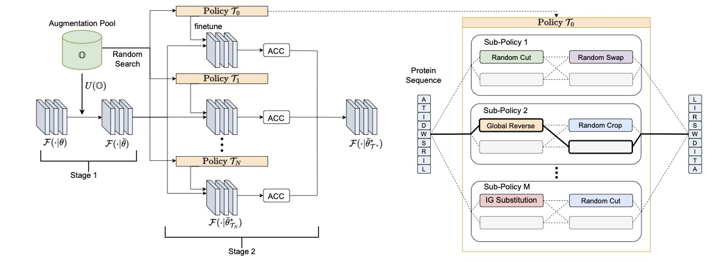

# Enhancing Protein Predictive Models via Proteins Data Augmentation: A Benchmark and New Directions

This is the official codebase of the paper [Enhancing Protein Predictive Models via Proteins Data Augmentation: A Benchmark and New Directions](), 

## Overview ##

Augmentation is an effective alternative to utilize the small amount of labeled protein data. However, most of the existing work focuses on designing new architectures or pre-training tasks, and relatively little work has studied data augmentation for proteins. This paper extends data augmentation techniques previously used for images and texts to proteins and then benchmarks these techniques on a variety of protein-related tasks, providing the first comprehensive evaluation of protein augmentation. Furthermore, we propose two novel semantic-level protein augmentation methods, namely Integrated Gradients Substitution and Back Translation Substitution, which enable protein semantic-aware augmentation through saliency detection and biological knowledge. Finally, we integrate extended and proposed augmentations into an augmentation pool and propose a simple but effective framework, namely __A__ utomated __P__ rotein __A__ ugmentation (APA), which can adaptively select the most suitable augmentation combinations for different tasks. Extensive experiments have shown that APA enhances the performance of five protein-related tasks by an average of 10.55\% across three architectures compared to vanilla implementations without augmentation, highlighting its potential to make a great impact on the field.



This codebase is based on PyTorch and [Torchdrug].
It supports training and inference with multiple GPUs or multiple machines.

[TorchDrug]: https://torchdrug.ai/

## Installation ##

You may install the dependencies of Torchdrug as below. 

```bash
conda env create -f environment.yaml

python setup.py develop

pip install torchviz, fair-esm, scipy==1.11, pyyaml, easydict
```
Besides, after install fair-esm, it's necessary to create a `__init__.py` in esm/model/

```
touch /root/miniconda3/envs/APA/lib/python3.9/site-packages/esm/model/__init__.py
```

## Reproduction ##

### Experimental Configurations ###

We provide a yaml based config for each experiment in our paper. 
The configs of all backbones are stored in ```./config/``` with the following folder structure:

```
config
 └── ESM-2-35M
     ├── Task_ESM.yaml
 ├── LSTM
 ├── ResNet
```

### Launch Experiments ###

In each config, we give a **suggested GPU configuration**, considering the tradeoff between *dataset size* and *computational resource*.
We assume **NVIDIA-A100-SXM4-80GB GPUs** as the computational resource.
You can change this default configuration based on your own computational resource.

*Note.* The benchmark results can be reproduced by taking the mean and std of three runs.

**Single-GPU.** By setting ```gpus: [0]```, the experiment is performed under a single GPU.
You can use the following command to run with seed 0, where all datasets will be automatically downloaded in the code.

Single-task learning experiment:
```bash
python apa/AutomatedProteinAugment.py -c config/$model/$yaml_config --seed 0
```

**Multi-GPU.** By setting ```gpus: [0,1,2,3]```, the experiment is performed under a single machine with 4 GPUs.
You can use the following command to run with seed 0.

Single-task learning experiment:
```bash
python -m torch.distributed.launch --nproc_per_node=4 apa/AutomatedProteinAugment.py -c config/$model/$yaml_config --seed 0
```

A instance of config(binloc_ESM.yaml):
```
output_dir: ~/scratch/torchprotein_output/

dataset:
  class: BinaryLocalization
  path: ~/scratch/protein-datasets/
  atom_feature: null
  bond_feature: null
  transform:
    class: Compose
    transforms:
      - class: TruncateProtein
        max_length: 550
        random: True
      - class: ProteinView
        view: "residue"

task:
  class: PropertyPrediction
  model:
    class: ESM
    path: ~/scratch/protein-model-weights/esm-model-weights/
    model: ESM-2-35M
  criterion: ce
  metric: ["acc", "mcc"]
  num_mlp_layer: 2
  batchnorm: True
  aug: APA
  
eval_metric: accuracy

optimizer:
  class: Adam
  lr: 2.0e-4

lr_ratio: 0.1

engine:
  gpus: [0, 1, 2, 3]
  batch_size: 4

train:
  num_epoch: 25

protein_auto_augment:
  search: True
  finetune_num: 25
  finetune_epoch: 5
  num_subpolicy: 4
  num_op: 2
```
